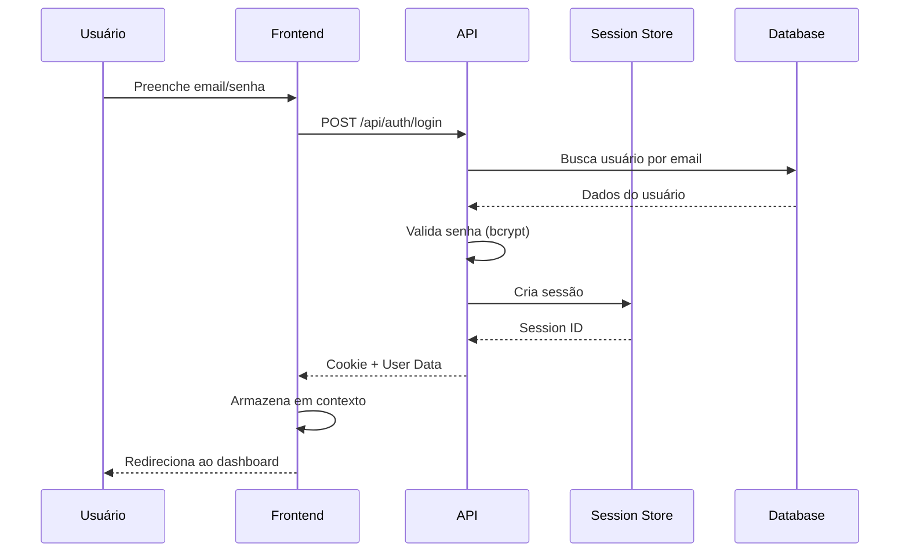
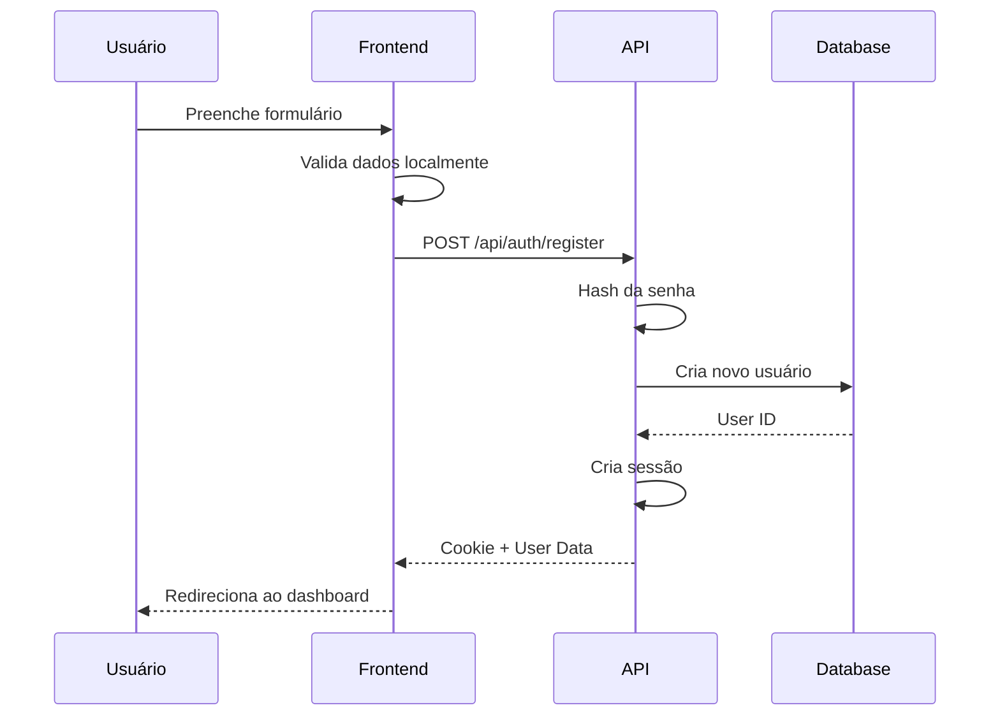
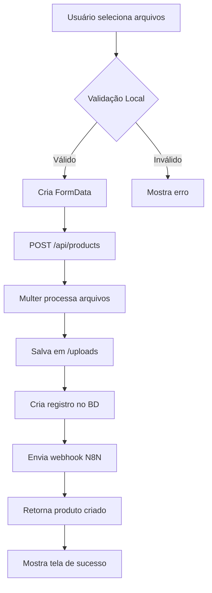
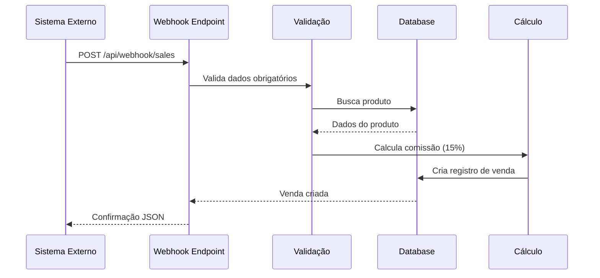
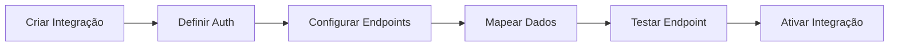
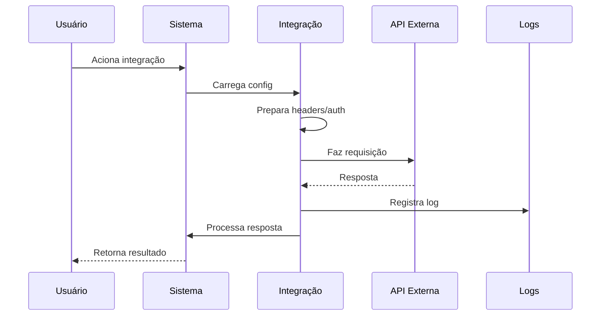
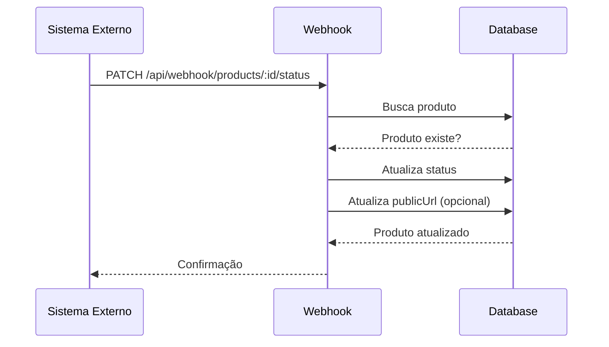
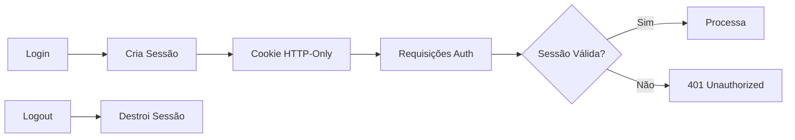

# Fluxos de Dados

## Visão Geral

Este documento detalha os principais fluxos de dados no sistema Upleer, desde a interação do usuário até o armazenamento no banco de dados.

## Fluxo de Autenticação

### Login de Usuário



### Registro de Novo Usuário



## Fluxo de Upload de Produto

### Upload Completo



### Processamento de Arquivos

1. **PDF do Livro**:
   - Validação: Deve ser PDF
   - Limite: 100MB
   - Armazenamento: Hash MD5 como nome

2. **Imagem de Capa**:
   - Validação: JPEG, PNG, GIF
   - Limite: 10MB
   - Armazenamento: Hash MD5 como nome

3. **Metadados**:
   - Título, autor, ISBN
   - Preço e margem
   - Gênero e idioma

## Fluxo de Vendas

### Recebimento de Venda via Webhook



### Dados Processados na Venda

```javascript
{
  // Entrada (Webhook)
  productId: 123,
  buyerEmail: "comprador@email.com",
  salePrice: "100.00",
  
  // Processamento
  commission: "15.00",        // 15% do valor
  authorEarnings: "85.00",    // Valor - comissão
  
  // Armazenamento
  authorId: "obtido do produto",
  createdAt: "timestamp"
}
```

## Fluxo de Integrações API

### Configuração de Integração



### Execução de Integração



## Fluxo de Dashboard

### Carregamento de Estatísticas

```mermaid
flowchart TD
    A[Dashboard Mount] --> B[useQuery Hook]
    B --> C[Parallel Requests]
    C --> D[/api/stats]
    C --> E[/api/products]
    C --> F[/api/sales/recent]
    D --> G[Aggregate Data]
    E --> G
    F --> G
    G --> H[Update UI]
```

### Dados Agregados

1. **Total de Vendas**: COUNT de sales
2. **Receita Total**: SUM de authorEarnings
3. **Produtos Ativos**: COUNT com status = 'approved'
4. **Produtos Pendentes**: COUNT com status = 'pending'

## Fluxo de Atualização de Status

### Via Webhook



## Fluxo de Sessão

### Gerenciamento de Sessão



### Armazenamento de Sessão

- Tabela `sessions` no PostgreSQL
- TTL: 7 dias
- Cookie seguro (HTTPS em produção)
- Renovação automática em atividade

## Fluxo de Arquivos

### Download de Arquivos

```mermaid
flowchart TD
    A[Requisição de Download] --> B{Tipo de Arquivo}
    B -->|PDF| C[/api/pdf/:filename]
    B -->|Imagem| D[/api/download/cover/:filename]
    C --> E[Verifica Existência]
    D --> E
    E -->|Existe| F[Detecta MIME Type]
    E -->|Não existe| G[404 Not Found]
    F --> H[Define Headers]
    H --> I[Stream do Arquivo]
```

## Otimizações de Performance

### Cache no Frontend

- TanStack Query com staleTime configurado
- Revalidação em foco de janela
- Cache de imagens via browser

### Otimizações no Backend

- Pool de conexões PostgreSQL
- Índices em campos de busca
- Queries otimizadas com Drizzle

### Otimizações de Rede

- Compressão gzip
- Headers de cache apropriados
- Lazy loading de componentes 