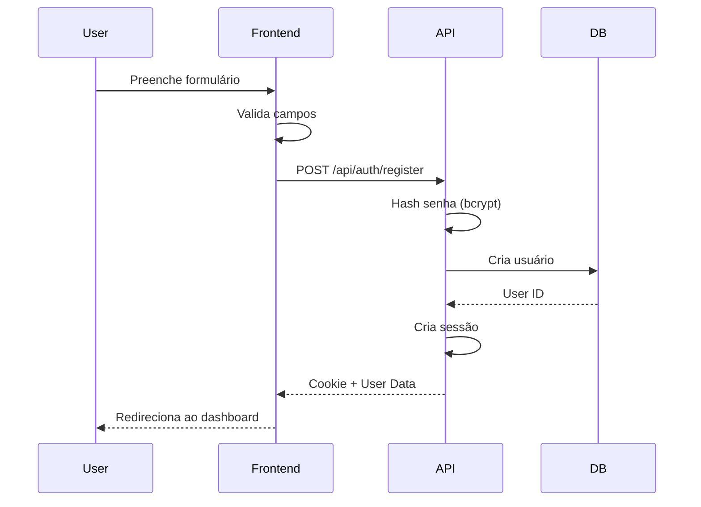
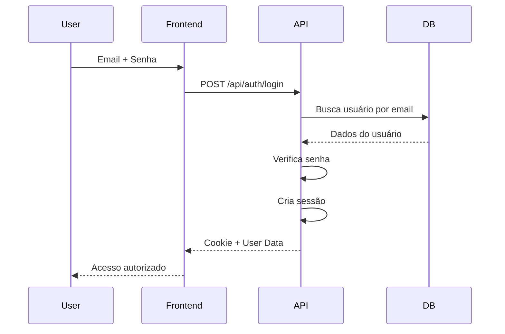

# Sistema de Autenticação

## Visão Geral

O Upleer utiliza autenticação baseada em sessões com armazenamento persistente no PostgreSQL. O sistema suporta registro local com email/senha e mantém as sessões seguras através de cookies HTTP-only.

## Arquitetura

### Componentes

1. **Frontend**
   - Hook `useAuth` para gerenciamento de estado
   - Páginas de Login/Register
   - Proteção de rotas

2. **Backend**
   - Express Session com connect-pg-simple
   - Bcrypt para hash de senhas
   - Middleware de autenticação

3. **Banco de Dados**
   - Tabela `users` para dados de usuário
   - Tabela `sessions` para sessões ativas

## Fluxo de Autenticação

### Registro



### Login



## Implementação Backend

### Configuração de Sessão

```typescript
// session-config.ts
export function createSessionConfig() {
  const sessionTtl = 7 * 24 * 60 * 60 * 1000; // 1 semana
  
  const pgStore = connectPgSimple(session);
  const sessionStore = new pgStore({
    conString: process.env.DATABASE_URL,
    createTableIfMissing: false,
    ttl: sessionTtl,
    tableName: "sessions",
  });
  
  return session({
    secret: process.env.SESSION_SECRET || 'default-secret',
    store: sessionStore,
    resave: false,
    saveUninitialized: false,
    cookie: {
      httpOnly: true,
      secure: process.env.NODE_ENV === 'production',
      sameSite: 'lax',
      maxAge: sessionTtl,
    },
  });
}
```

### Endpoints de Autenticação

#### Register
```typescript
// POST /api/auth/register
{
  email: string,
  password: string,
  firstName: string,
  lastName: string
}

// Validações:
- Email único
- Senha mínimo 6 caracteres
- Campos obrigatórios
```

#### Login
```typescript
// POST /api/auth/login
{
  email: string,
  password: string
}

// Process:
1. Busca usuário por email
2. Verifica senha com bcrypt
3. Cria sessão
4. Retorna dados do usuário
```

#### Logout
```typescript
// POST /api/auth/logout

// Process:
1. Destroi sessão
2. Limpa cookie
```

### Middleware de Proteção

```typescript
export const requireAuth: RequestHandler = async (req, res, next) => {
  const userId = req.session?.userId;
  
  if (!userId) {
    return res.status(401).json({ message: 'Não autorizado' });
  }
  
  try {
    const user = await storage.getUser(userId);
    if (!user) {
      return res.status(401).json({ message: 'Usuário não encontrado' });
    }
    
    req.userId = user.id;
    req.user = user;
    next();
  } catch (error) {
    res.status(500).json({ message: 'Erro ao verificar autenticação' });
  }
};
```

## Implementação Frontend

### Hook useAuth

```typescript
export function useAuth() {
  const queryClient = useQueryClient();
  
  const { data, isLoading, error } = useQuery({
    queryKey: ['auth-user'],
    queryFn: async () => {
      const response = await fetch('/api/auth/user');
      if (!response.ok) throw new Error('Not authenticated');
      return response.json();
    },
    retry: false,
    staleTime: 5 * 60 * 1000, // 5 minutos
  });
  
  const logout = useMutation({
    mutationFn: async () => {
      await fetch('/api/auth/logout', { method: 'POST' });
    },
    onSuccess: () => {
      queryClient.clear();
      window.location.href = '/';
    }
  });
  
  return {
    user: data?.user,
    isAuthenticated: !!data?.user,
    isLoading,
    error,
    logout: logout.mutate,
    refetch: () => queryClient.invalidateQueries(['auth-user'])
  };
}
```

### Proteção de Rotas

```typescript
function Router() {
  const { isAuthenticated, isLoading } = useAuth();
  
  if (isLoading) {
    return <LoadingScreen />;
  }
  
  return (
    <Switch>
      {!isAuthenticated ? (
        <>
          <Route path="/" component={Landing} />
          <Route path="/login" component={Login} />
          <Route path="/register" component={Register} />
          {/* Redireciona rotas protegidas */}
          <Route path="/dashboard" component={Landing} />
        </>
      ) : (
        <>
          <Route path="/" component={Dashboard} />
          <Route path="/dashboard" component={Dashboard} />
          <Route path="/products" component={Products} />
          {/* Outras rotas protegidas */}
        </>
      )}
    </Switch>
  );
}
```

## Segurança

### Hash de Senhas

```typescript
// Registro
const hashedPassword = await bcrypt.hash(password, 12);

// Login
const isValid = await bcrypt.compare(password, user.password);
```

### Cookies Seguros

- **httpOnly**: Previne acesso via JavaScript
- **secure**: HTTPS apenas em produção
- **sameSite**: Proteção CSRF
- **maxAge**: Expiração automática

### Validações

1. **Email**:
   - Formato válido
   - Único no sistema

2. **Senha**:
   - Mínimo 6 caracteres
   - Hash com salt factor 12

3. **Sessão**:
   - TTL de 7 dias
   - Renovação em atividade

## Roles e Permissões

### Roles Disponíveis

1. **author** (padrão)
   - Acesso ao dashboard
   - Gerenciar próprios produtos
   - Ver próprias vendas

2. **admin**
   - Acesso total ao sistema
   - Gerenciar todos os produtos
   - Ver todas as vendas
   - Configurações avançadas

### Verificação de Permissões

```typescript
// Middleware para admin
export const requireAdmin: RequestHandler = async (req, res, next) => {
  if (req.user?.role !== 'admin') {
    return res.status(403).json({ message: 'Acesso negado' });
  }
  next();
};
```

## Tratamento de Erros

### Erros Comuns

1. **401 Unauthorized**
   - Sessão expirada
   - Não autenticado

2. **403 Forbidden**
   - Sem permissão para recurso
   - Role inadequada

3. **400 Bad Request**
   - Dados inválidos
   - Email já em uso

### Mensagens de Erro

```typescript
const errorMessages = {
  'invalid_credentials': 'Email ou senha incorretos',
  'email_in_use': 'Email já está em uso',
  'session_expired': 'Sessão expirada, faça login novamente',
  'unauthorized': 'Acesso não autorizado',
  'forbidden': 'Você não tem permissão para esta ação'
};
```

## Melhores Práticas

### 1. Segurança

- Sempre use HTTPS em produção
- Mantenha SESSION_SECRET seguro
- Implemente rate limiting
- Log de tentativas de login falhas

### 2. UX

- Feedback claro de erros
- Loading states durante auth
- Redirect apropriado pós-login
- Remember me opcional

### 3. Manutenção

- Limpar sessões expiradas
- Monitorar tentativas de login
- Backup de dados de usuário
- Auditoria de mudanças

## Fluxo de Recuperação de Senha

*Não implementado atualmente*

Sugestão para implementação futura:

1. Usuário solicita reset
2. Gera token único com expiração
3. Envia email com link
4. Valida token e permite nova senha
5. Invalida token após uso

## Integração com OAuth

*Preparado mas não implementado*

O sistema está preparado para OAuth:
- Campo `password` nullable
- Estrutura para providers
- Hook extensível 