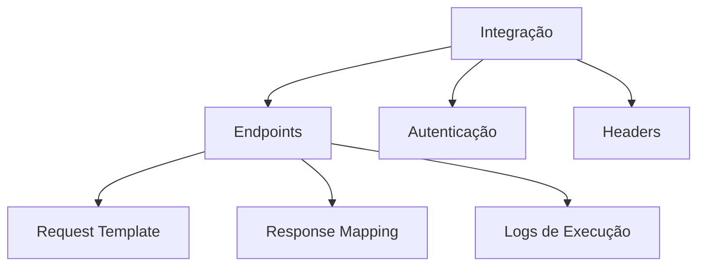
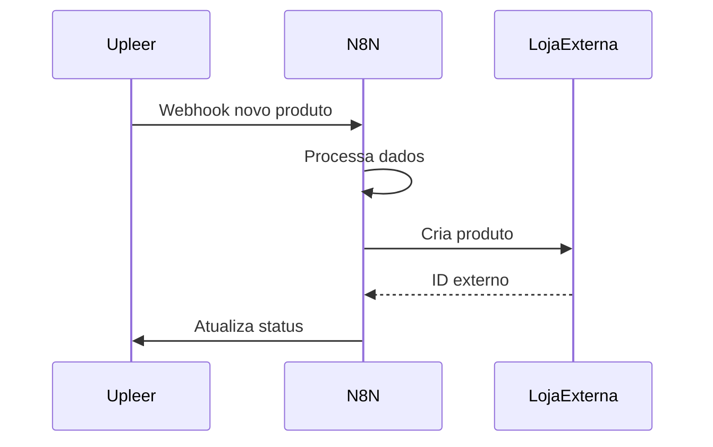
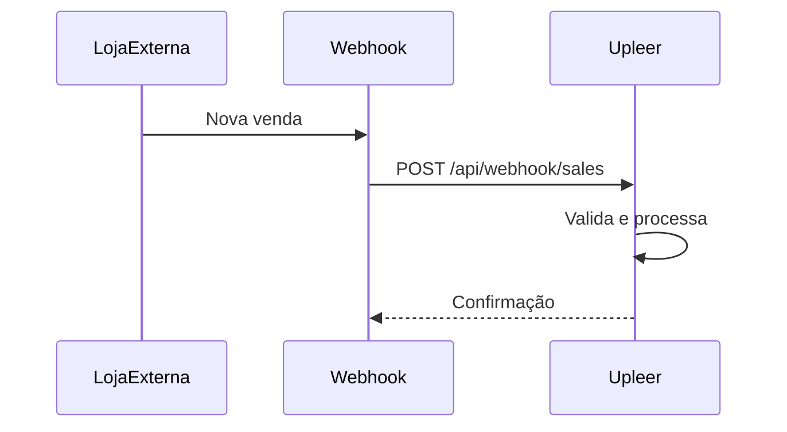

# Integrações e Webhooks

## Visão Geral

O Upleer possui um sistema robusto de integrações que permite:
- Receber dados via webhooks
- Enviar dados para sistemas externos
- Configurar APIs customizadas
- Monitorar execuções

## Webhooks

### Webhooks de Entrada

#### 1. Webhook de Vendas

**Endpoint:** `POST /api/webhook/sales`

**Propósito:** Receber notificações de vendas realizadas em plataformas externas.

**Payload:**
```json
{
  "productId": 123,
  "buyerName": "João Silva",
  "buyerEmail": "joao@email.com",
  "buyerPhone": "11999999999",
  "buyerCpf": "12345678900",
  "buyerAddress": "Rua A, 123",
  "buyerCity": "São Paulo",
  "buyerState": "SP",
  "buyerZipCode": "01234-567",
  "salePrice": 29.90,
  "orderDate": "2024-01-15T10:30:00Z",
  "paymentStatus": "aprovado",
  "paymentMethod": "cartao_credito",
  "installments": 1,
  "discountCoupon": "PROMO10",
  "discountAmount": 2.99,
  "shippingCost": 5.00,
  "shippingCarrier": "Correios",
  "deliveryDays": 7
}
```

**Processamento:**
1. Valida dados obrigatórios
2. Verifica se produto existe
3. Calcula comissão (15%)
4. Cria registro de venda
5. Retorna confirmação

**Response:**
```json
{
  "message": "Venda registrada com sucesso",
  "sale": {
    "id": 456,
    "productId": 123,
    "productTitle": "Meu Livro",
    "authorId": "789",
    "authorName": "Maria Autor",
    "buyerName": "João Silva",
    "salePrice": "29.90",
    "commission": "4.49",
    "authorEarnings": "25.41",
    "paymentStatus": "aprovado"
  }
}
```

#### 2. Webhook de Status de Produto

**Endpoint:** `PATCH /api/webhook/products/:id/status`

**Propósito:** Atualizar status de produtos quando aprovados/publicados externamente.

**Payload:**
```json
{
  "status": "published",
  "publicUrl": "https://loja.com/produto/meu-livro-123"
}
```

**Status Válidos:**
- `pending`: Aguardando aprovação
- `published`: Publicado na loja
- `rejected`: Rejeitado
- `archived`: Arquivado

### Webhooks de Saída

#### Webhook para N8N

**Trigger:** Criação de novo produto

**URL:** `https://auton8n.upleer.com.br/webhook-test/[webhook-id]`

**Payload Enviado:**
```json
{
  "id": 123,
  "title": "Título do Livro",
  "description": "Descrição completa...",
  "author": "Nome do Autor",
  "isbn": "978-3-16-148410-0",
  "coAuthors": "Co-autor 1, Co-autor 2",
  "genre": "ficção",
  "language": "português",
  "targetAudience": "adulto",
  "pageCount": 200,
  "baseCost": "10.00",
  "salePrice": "29.90",
  "marginPercent": 150,
  "status": "pending",
  "authorId": "author-123",
  "pdfUrl": "/uploads/hash123",
  "coverImageUrl": "/uploads/hash456",
  "publicUrl": null,
  "createdAt": "2024-01-15T10:30:00Z",
  "updatedAt": "2024-01-15T10:30:00Z",
  "downloadUrls": {
    "productDetails": "https://domain.com/api/products/123",
    "pdfDownload": "https://domain.com/api/pdf/hash123",
    "pdfDirect": "https://domain.com/uploads/hash123",
    "coverDownload": "https://domain.com/api/download/cover/hash456"
  }
}
```

**Logs:**
- Sucesso: `/tmp/webhook-debug.log`
- Resposta: `/tmp/webhook-response.log`
- Erros: `/tmp/webhook-error.log`

## Sistema de Integrações API

### Arquitetura



### Configuração de Integração

#### 1. Criar Integração

```typescript
{
  name: "API Externa",
  description: "Integração com sistema X",
  baseUrl: "https://api.externa.com",
  authType: "bearer", // api_key | oauth | bearer | basic
  authConfig: {
    token: "seu-token-aqui"
  },
  headers: {
    "Content-Type": "application/json",
    "X-Custom-Header": "value"
  },
  isActive: true
}
```

#### 2. Configurar Endpoints

```typescript
{
  integrationId: 1,
  name: "Criar Produto",
  endpoint: "/products",
  method: "POST",
  requestBody: {
    // Template com placeholders
    "title": "{{product.title}}",
    "price": "{{product.salePrice}}",
    "description": "{{product.description}}"
  },
  responseMapping: {
    // Como mapear a resposta
    "externalId": "$.data.id",
    "status": "$.data.status"
  },
  isActive: true
}
```

### Tipos de Autenticação

#### 1. API Key
```json
{
  "authType": "api_key",
  "authConfig": {
    "headerName": "X-API-Key",
    "apiKey": "sua-chave-aqui"
  }
}
```

#### 2. Bearer Token
```json
{
  "authType": "bearer",
  "authConfig": {
    "token": "seu-token-jwt"
  }
}
```

#### 3. Basic Auth
```json
{
  "authType": "basic",
  "authConfig": {
    "username": "usuario",
    "password": "senha"
  }
}
```

#### 4. OAuth 2.0
```json
{
  "authType": "oauth",
  "authConfig": {
    "clientId": "client-id",
    "clientSecret": "client-secret",
    "tokenUrl": "https://oauth.provider.com/token",
    "scope": "read write"
  }
}
```

### Execução de Integrações

#### Teste Manual

O sistema possui um testador de endpoints integrado que permite:

1. **Editar Headers**
   ```json
   {
     "Authorization": "Bearer token",
     "X-Custom": "value"
   }
   ```

2. **Editar Body**
   ```json
   {
     "campo1": "valor1",
     "campo2": "valor2"
   }
   ```

3. **Ver Resposta**
   - Status HTTP
   - Headers de resposta
   - Body formatado
   - Tempo de execução

#### Execução Programática

```typescript
// Exemplo de execução via código
async function executeIntegration(integrationId: number, endpointId: number, data: any) {
  const integration = await storage.getApiIntegration(integrationId);
  const endpoint = await storage.getApiEndpoint(endpointId);
  
  // Prepara headers
  const headers = {
    ...integration.headers,
    ...getAuthHeaders(integration)
  };
  
  // Substitui placeholders no body
  const body = replacePlaceholders(endpoint.requestBody, data);
  
  // Executa requisição
  const response = await fetch(
    `${integration.baseUrl}${endpoint.endpoint}`,
    {
      method: endpoint.method,
      headers,
      body: JSON.stringify(body)
    }
  );
  
  // Log da execução
  await storage.createApiLog({
    integrationId,
    endpointId,
    method: endpoint.method,
    url: `${integration.baseUrl}${endpoint.endpoint}`,
    requestHeaders: headers,
    requestBody: body,
    responseStatus: response.status,
    responseBody: await response.json(),
    responseTime: executionTime
  });
  
  return response;
}
```

### Logs e Monitoramento

#### Estrutura de Logs

```typescript
{
  id: 1,
  integrationId: 1,
  endpointId: 1,
  method: "POST",
  url: "https://api.externa.com/products",
  requestHeaders: { /* ... */ },
  requestBody: { /* ... */ },
  responseStatus: 200,
  responseHeaders: { /* ... */ },
  responseBody: { /* ... */ },
  responseTime: 234, // ms
  errorMessage: null,
  createdAt: "2024-01-15T10:30:00Z"
}
```

#### Visualização de Logs

A página de logs permite:
- Filtrar por integração
- Filtrar por status (sucesso/erro)
- Ver detalhes de cada execução
- Exportar logs

## Casos de Uso

### 1. Sincronização de Produtos



### 2. Importação de Vendas



### 3. Atualização em Massa

```typescript
// Script para atualizar múltiplos produtos
async function syncAllProducts() {
  const products = await storage.getAllProducts();
  
  for (const product of products) {
    if (product.status === 'approved' && !product.publicUrl) {
      await executeIntegration(
        INTEGRATION_ID,
        CREATE_PRODUCT_ENDPOINT,
        product
      );
    }
  }
}
```

## Segurança

### Webhooks de Entrada

1. **Validação de Origem**
   - Implementar whitelist de IPs
   - Verificar assinatura HMAC
   - Rate limiting

2. **Validação de Dados**
   - Schemas Zod para validação
   - Sanitização de inputs
   - Verificação de tipos

### Integrações de Saída

1. **Armazenamento Seguro**
   - Tokens em variáveis de ambiente
   - Criptografia de credenciais sensíveis
   - Rotação periódica de tokens

2. **Timeouts e Retry**
   - Timeout de 30 segundos
   - Retry com backoff exponencial
   - Circuit breaker para falhas repetidas

## Troubleshooting

### Webhook não recebido

1. Verificar logs do servidor
2. Testar com curl/Postman
3. Verificar firewall/proxy
4. Validar formato JSON

### Integração falhando

1. Verificar credenciais
2. Testar endpoint manualmente
3. Verificar logs de erro
4. Validar mapeamento de dados

### Performance

1. Implementar queue para webhooks
2. Processar em background
3. Cachear respostas quando possível
4. Monitorar tempos de resposta 